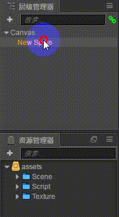
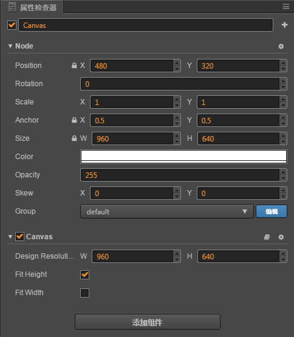
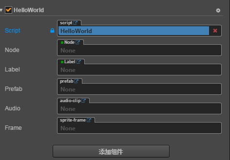

# cocos-creator
### 学习了一段时间的cocos-creator，总结了一些经验 
---

#### 场景处理
  + [预制场景](#scene)
  + [场景属性](#attr)
  + [兼容场景](#compatibility)
#### 资源加载
  + [本地资源加载](#inside)
  + [外部资源加载](#outside)
  + [当前资源引用](#atPresent)
  + [require 请求资源](#require)
#### 主要组件的使用
  + [sprite 图层精灵组件](#sprite)
  + [animation 动画组件](#animation)
  + [label 文字渲染组件](#label)
  + [mask 遮罩组件](#mask)
  + [button 按钮组件](#button)
  + [widget 位置布局组件](#addr)
####  js代码编写注意事项
  + [properties 外部属性声明](#outattr)
  + [es6](#es6)
  + [update 每帧调用方法](#frame)
  
----
### **场景处理**
  1. 预制场景  
    &emsp;&emsp;在cocos creator编辑器的层级管理器中，拖动一个节点到资源管理器中就可以生成一个预支节点，实际使用中我们可以认为预制场景就是一个组件/模块；你可以把任何一个节点变成一个预制场景以便在 [当前资源引用](#atPresent) 中使用他;  如下图：  
    

  2. 场景属性 
    &emsp;&emsp;场景数据分为两大属性：node节点属性和组件属性 
    node节点属性主要是控制场景的样式，包括位置、高宽、颜色、透明度、放大缩小倍数等等 
    组件属性主要是自带组件特殊设置，如果是用户组件，属性就是用户组件的properties引入项
    

   3. 兼容场景 
    &emsp;&emsp; 在我们制作一个场景放在移动端测试的时候，往往场景不能铺满整个页面，这个时候，我们就要做兼容场景处理。 
    在canvas顶层节点上，有一个canvas属性: 
    其中Fit Height 是拉伸高度，使场景高度占满整个屏幕，适用于竖屏类游戏，例如敲砖块，飞机大战； 
    Fit Width 是拉伸宽度，使宽度刚好占满屏幕，此时我们需把子节点场景的高度设置到大于canvas场景的高度，否则游戏上下会出现黑边。

### **资源加载**
  1. 本地资源加载 
   &emsp;&emsp;在我们开发游戏的时候，sprite组件的spriteFrame属性往往是空置的，我们需要用js引入本地资源： 
  首先，要想引入本地资源，我们一定要在`资源管理器`中，assets文件夹下创建名为resources文件夹，并把你想要引入的资源放入该文件下。 
  然后，调用cc.loader.loadRes引入本地文件 

    cc.loader.loadRes(url, cc.SpriteFrame, (err, sf) => {
        node.getComponent(cc.Sprite).spriteFrame = sf;
    })

2. 外部资源加载 
 &emsp;&emsp;在游戏连接服务器获取用户信息的时候，我们就要引入后端传入的url，此时就要外部资源加载。 
 我们可以直接调用cc.loader.load引入外部资源 

    cc.loader.load(url, (err, sf) => {
        node.getComponent(cc.Sprite).spriteFrame = new cc.SpriteFrame(sf);
    })

3. 当前资源引用 
  &emsp;&emsp;当前资源引用主要是针对用户脚本组件(js)中的properties对象的声明引用，声明类型主要如下几种

    properties: {
        Node: {
            default: null,
            type: cc.Node       //节点资源
        },
        Label: {
            default: null,
            type: cc.Label      //文本资源
        },
        Prefab: {
            default: null,
            type: cc.Prefab     //预制场景资源
        },
        Audio: {
            default: null,
            url: cc.AudioClip    //音频资源
        },
        frame: {
            default: null,
            type: cc.SpriteFrame   //图层资源
        }
    }
当设置完以上几种类型属性的时候，我们的`属性检查器`中就会出现如下的引入框，我们选择对应的资源拖入其中，就可以完成当前资源的引用 

3. require 请求资源 
&emsp;&emsp;在写代码的过程中我们会遇到好多重复的代码，此时我们可以把公用的代码提取成一个js插件，然后用require引入，require不仅可以引入公用插件，还能引入cc.class整个脚本组件，下面介绍一下require的这两种用法：

引入公用插件：

    /*common.js*/
    module.exports = {
      Fun(){
          console.log('这是一个公用的方法');
      }
    } 

    /* game.js*/
    const common = require('commmon');
    common.Fun();

引入cc.class脚本组件：

    /* game.js 注册脚本组件*/
    const ClassFun =  cc.Class({
      extends: cc.Component,
      properties: {
          
      },
      onLoad: function () {
          this.label.string = this.text;
      },
      gameFun:function(){
        console.log('我是game.js里面的方法')
      },
      update: function (dt) {

      },
    });
    module.exports = ClassFun;
-----
    /*  body.js 接受脚本组件*/
    const game = require('game');
    cc.Class({
      extends: cc.Component,
      properties: {
          Game:{
            defaule:null,
            type:game
          }
      },
      onLoad: function () {
          this.Game.gameFun();
      },
      update: function (dt) {

      },
    });

### **主要组件的使用**
[1. sprite 图层精灵组件](http://docs.cocos.com/creator/manual/zh/components/sprite.html) 
  用法：`属性检查器>添加组件>添加渲染组建>sprite`  
  &emsp;&emsp;在资源管理器中拖入图片资源到 sprite组建中的spriteFrame属性中即可引用 
  如果我们想要在脚本组建(js)替换掉图层的时候，我们可以使用 [资源加载](#inside)的方法进行替换 

[2. animation 动画组件](http://docs.cocos.com/creator/manual/zh/components/animation.html) 
  用法：`属性检查器>添加组件>添加其他组件>Animation`  
  &emsp;&emsp;资源管理器中右键创建Animation Clip文件，开启动画编辑器，针对不同的动作可以在 `属性列表`中选择相应的属性；然后在Animation 中引入Animation Clip即可

  const Animation = node.getComponent(cc.Animation);
  Animation.playAdditive();//调用播放

[3. label 文字渲染组件](http://docs.cocos.com/creator/manual/zh/components/label.html) 
  用法：`属性检查器>添加组件>添加渲染组建>Label`  

    node.getComponent(cc.Label).string = "替换的文字";
  *添加文字的时候我们可以使用`属性检查器>添加组件>添加渲染组建>LabelOutline`组件给字体添加阴影，是文字更有立体感。

[4. mark 遮罩组件](http://docs.cocos.com/creator/manual/zh/components/mask.html){#mark} 

 ========>变